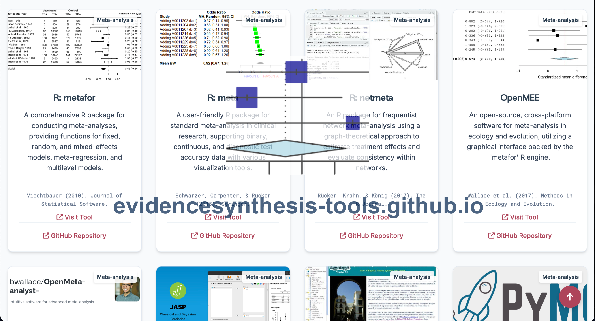
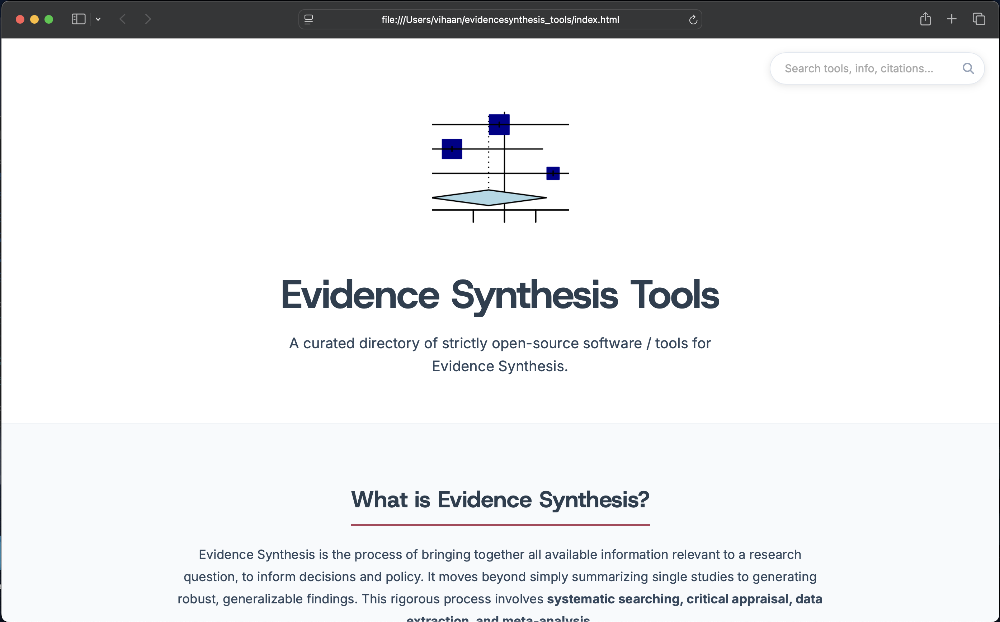
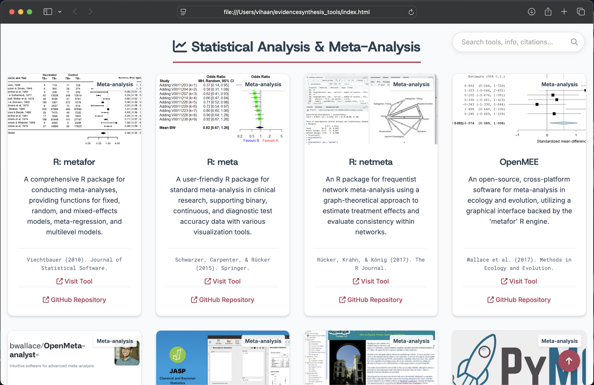
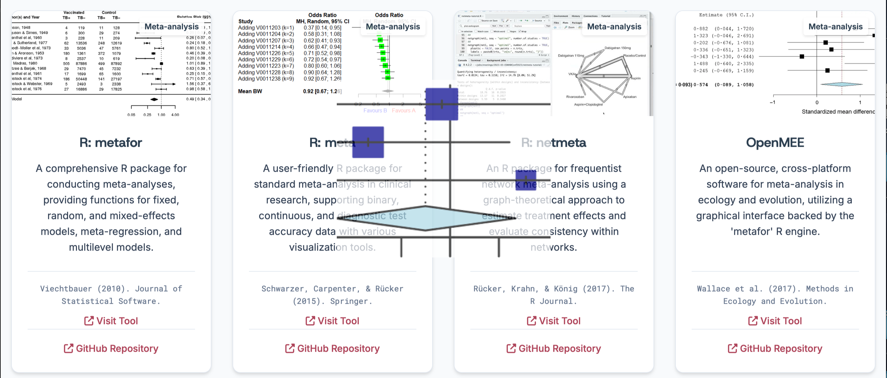

---

##  Overview

This resource is intended for:

* Systematic review researchers and students
* Meta-analysis practitioners
* Medical and public health researchers
* Librarians and methodologists
* Open science advocates
* Research software developers 

The directory includes **140** open source non properietary tools / softwares available **up to 2026**, covering all stages of the evidence synthesis pipeline.

---

## ❓ What is Evidence Synthesis?

Evidence synthesis is the systematic process of identifying, evaluating, and integrating all available evidence relevant to a research question to inform scientific conclusions, policy, and practice.

Core components include:

* Systematic searching 
* Screening and study selection
* Critical appraisal
* Data extraction
* Risk of Bias assessment
* Quantitative or qualitative synthesis

The goal is to produce **transparent, reproducible, and generalizable findings**.

---

## 📖 Scope of the Directory

The directory covers the full workflow:

* Search strategy development
* Citation chasing and retrieval
* Reference management and deduplication
* AI-assisted screening and prioritization 
* Data extraction and PDF processing
* Risk of Bias assessment and visualization
* Statistical analysis and meta-analysis 
* Evidence mapping and bibliometrics
* Automation, scripting, and machine learning
* Qualitative synthesis tools

Tools range from full platforms to lightweight libraries and utilities.

---

## 🌍 Why This Matters (Impact)

Evidence synthesis underpins evidence-based medicine, public health, environmental science, and policy decision-making. However, the current software ecosystem presents several challenges:

* Many widely used tools are **proprietary or closed-source**
* Existing directories often mix software with checklists, guidance documents, or non-software resources
* **Source code availability and licensing are unclear or inconsistent**
* Limited transparency restricts reproducibility and independent verification
* Researchers and developers struggle to identify reusable open implementations

This project addresses these gaps by providing:

* A **strict open-source-only directory**
* Verification of public repositories and licenses
* A **software-focused resource** (no mixed content)
* A discovery platform for **reusable research software**
* Support for **Open Science and FAIR principles**
* A foundation for developing interoperable and transparent evidence synthesis tools

In contrast to existing resources such as the *Systematic Review Toolbox (SR Toolbox)*, which includes proprietary and mixed-content entries and has limited transparency regarding source code and updates, this repository is designed specifically to support **reproducibility, transparency, and research software reuse**.

---

## 🔓 Directory Policy (Strict Inclusion Criteria)

Only tools meeting **all** criteria are included:

### 1. Open Source License

Released under a recognized license (MIT, GPL, Apache, etc.)

### 2. Public Code Repository

Source code must be publicly available (GitHub, GitLab, Bitbucket)

### 3. Non-Proprietary

* No closed-source components
* No mandatory commercial dependencies
* No institutional license requirements

### 4. Reusable & Extensible ♻️

Documentation must allow reuse, modification, and community development.

### 5. Research-Relevant

Relevant to systematic reviews, evidence synthesis, meta-analysis, or closely related workflows.

**Excluded examples:**
EndNote, Covidence, DistillerSR, NVivo, Rayyan, Stata, SAS, and similar proprietary or freemium tools.

---

## 🔍 Why Open Source?

This project prioritizes open-source tools to ensure:

* **Transparency** – inspect underlying algorithms
* **Reproducibility** – avoid black-box systems
* **Sustainability** – independence from commercial vendors
* **Innovation** – fork, modify, and build upon tools 🚀
* **Equity** – global access without paywalls

---

## 🧩 Technical Design Philosophy

The website is intentionally implemented using **pure HTML**.

This ensures:

* No framework or dependency lock-in
* Long-term stability and preservation
* Easy editing using any text editor
* Contributions from users with **little or no coding experience**

This design prioritizes accessibility, sustainability, and long-term community maintenance.

---

## ✨ Novelty and Rationale

Existing directories such as the **Systematic Review Toolbox (SR Toolbox)** have several limitations:

* Inclusion of proprietary and commercial tools
* Mixing of software with checklists and guidance documents
* Source code availability often unclear
* Licensing not systematically verified
* Limited update transparency
* Underlying platform source code not publicly available

Initially, the author attempted to update newly identified tools within existing platforms. However, the absence of publicly accessible source code limited transparency, extensibility, and community contribution.

### What makes this project different?

* Strict **open-source-only policy**
* Verified public repositories and licenses
* Software-only focus
* Pure HTML for easy maintenance
* Designed to support **research software discovery and reuse**
* Enables developers to inspect, extend, and build upon existing implementations

This makes the project uniquely aligned with **Open Science and research software sustainability principles**.

---

## 🛠️ For Research Software Developers

This repository helps developers:

* Discover fully open implementations
* Inspect real-world evidence synthesis codebases
* Reuse and extend existing tools
* Develop interoperable and transparent research software

---

## ✨  Interface

---

## ⭐ Contributions

This directory aims to be a comprehensive community resource.

### Submit a tool via:

* Pull Request (preferred) [evidencesynthesis-tools.github.io/pulls](https://github.com/evidencesynthesis-tools/evidencesynthesis-tools.github.io/pulls)
* GitHub Issue [evidencesynthesis-tools.github.io/issues](https://github.com/evidencesynthesis-tools/evidencesynthesis-tools.github.io/issues)
* GitHub Discussions [evidencesynthesis-tools/discussions](https://github.com/orgs/evidencesynthesis-tools/discussions)
* Email to the maintainer [V.S.](mailto:pteroisvolitans12@gmail.com)

### Requirements

* Open-source license
* Public repository
* No closed-source components
* No paid or institutional restrictions
* Relevant to evidence synthesis
* Adequate documentation

**Not accepted**

* Free but closed-source tools
* Freemium software
* Commercial or license-restricted platforms

---

## ⭐ Citation

If you use this directory or related tools, please cite:

Sahu, V. (2026). *Evidence Synthesis Tools: A curated directory of strictly open-source software / tools for Evidence Synthesis.* (Version 1.0). Zenodo.
[https://doi.org/10.5281/zenodo.18681868](https://doi.org/10.5281/zenodo.18681868)

Individual tools retain their original citations.

---

##  License

© 2026 Vihaan Sahu
Licensed under the **Apache License 2.0**

---

##  Contact

* GitHub: Issues / Pull Requests / Discussions
* Email: [pteroisvolitans12@gmail.com](mailto:pteroisvolitans12@gmail.com)
---

*Built for the research community to advance open, transparent, and reproducible evidence synthesis 🌐*